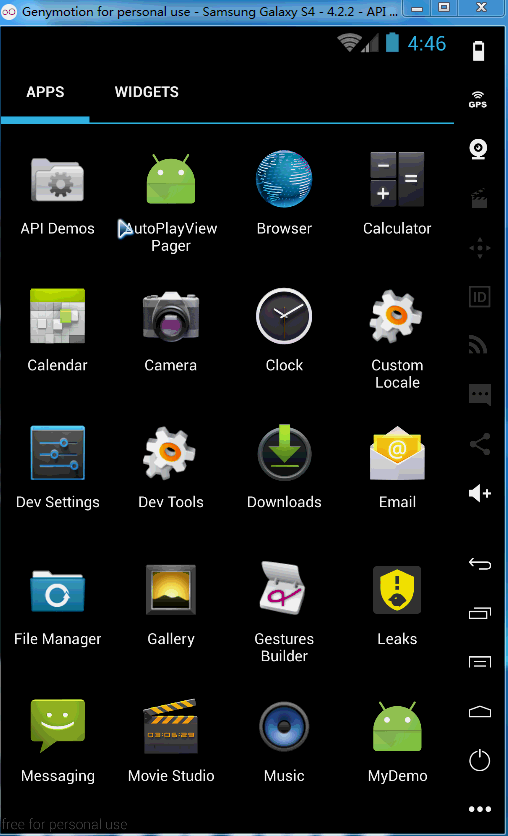
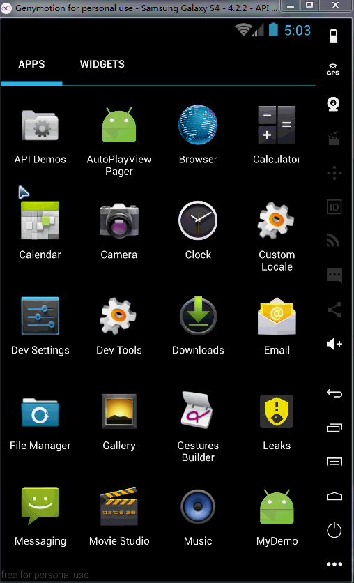

# AutoPlayViewPager
仿京东、淘宝，横向自动轮播图。Auto Play ViewPager。

# 效果

# Gradle
	//使用 autoplay viewpager
	compile ('com.xyzlf.autoplay.viewpager:viewpager:0.0.3') {
	    exclude group: 'com.android.support', module: 'appcompat-v7'
	}

# 使用方式

1、在xml中使用，如下：
	
	<!-- 使用默认颜色，大小，间距 -->
    <com.xyzlf.autoplay.viewpager.CustomerBanner
	    android:id="@+id/banner"
	    android:layout_width="match_parent"
	    android:layout_height="150dp"/>

	<!--自定义颜色，大小，间距-->
	<com.xyzlf.autoplay.viewpager.CustomerBanner
        android:id="@+id/banner"
        android:layout_width="match_parent"
        android:layout_height="150dp"
        custom:indicator_radius="3dp"
        custom:indicator_span="16dp"
        custom:indicator_selected_color="#ff0000"
        custom:indicator_unselected_color="#00ff00"
        custom:indicator_bottommargin="20dp"/>

2、代码中使用：

	List<Integer> list = new ArrayList<>();
    list.add(R.drawable.pic_1);
    list.add(R.drawable.pic_2);
    list.add(R.drawable.pic_3);
    list.add(R.drawable.pic_4);
        
    CustomerBanner banner = (CustomerBanner) findViewById(R.id.banner);
    banner.setAdapter(new AutoPlayPagerAdapter(list));

3、Adapter需要继承 **AutoPagerAdapter**，完整Adapter代码如下：

	public class AutoPlayPagerAdapter extends AutoPagerAdapter {

	    private List<Integer> list;
	
	    public AutoPlayPagerAdapter(List<Integer> list) {
	        this.list = list;
	    }
	
	    @Override
	    public View getView(LayoutInflater layoutInflater, int position) {
	        ImageView imageView = new ImageView(getApplicationContext());
	        ViewGroup.LayoutParams params = new ViewGroup.LayoutParams(ViewGroup.LayoutParams.MATCH_PARENT, ViewGroup.LayoutParams.WRAP_CONTENT);
	        imageView.setLayoutParams(params);
	        int resId = list.get(getPositionForIndicator(position));
	        imageView.setImageDrawable(ContextCompat.getDrawable(MainActivity.this, resId));
	        return imageView;
	    }
	
	    @Override
	    public int getDataCount() {
	        return list == null ? 0 : list.size();
	    }
	}

可以下载Demo看看，代码是最好的老师。借用前同事的一句名言：“代码面前，了无秘密”。

# 关于我
有任何使用问题，可以给我发邮件：

Author：张利峰

E-mail：519578280@qq.com

# License

    Copyright (C)  LessCode Open Source Project
    
    Licensed under the Apache License, Version 2.0 (the "License");
    you may not use this file except in compliance with the License.
    You may obtain a copy of the License at
    
    http://www.apache.org/licenses/LICENSE-2.0
    
    Unless required by applicable law or agreed to in writing, software
    distributed under the License is distributed on an "AS IS" BASIS,
    WITHOUT WARRANTIES OR CONDITIONS OF ANY KIND, either express or implied.
    See the License for the specific language governing permissions and
    limitations under the License.